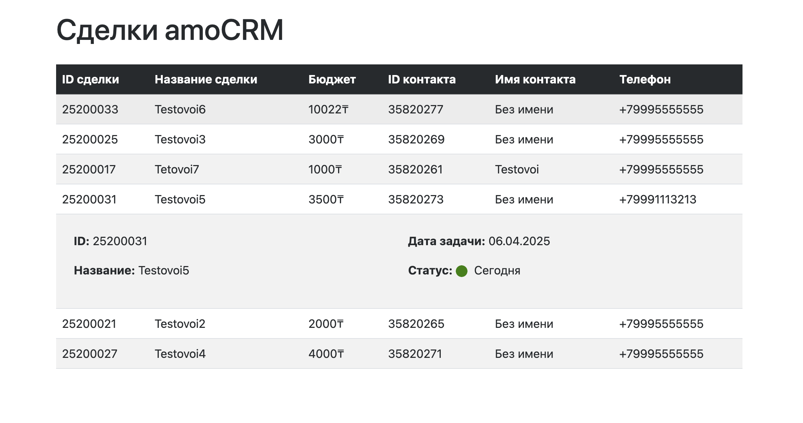
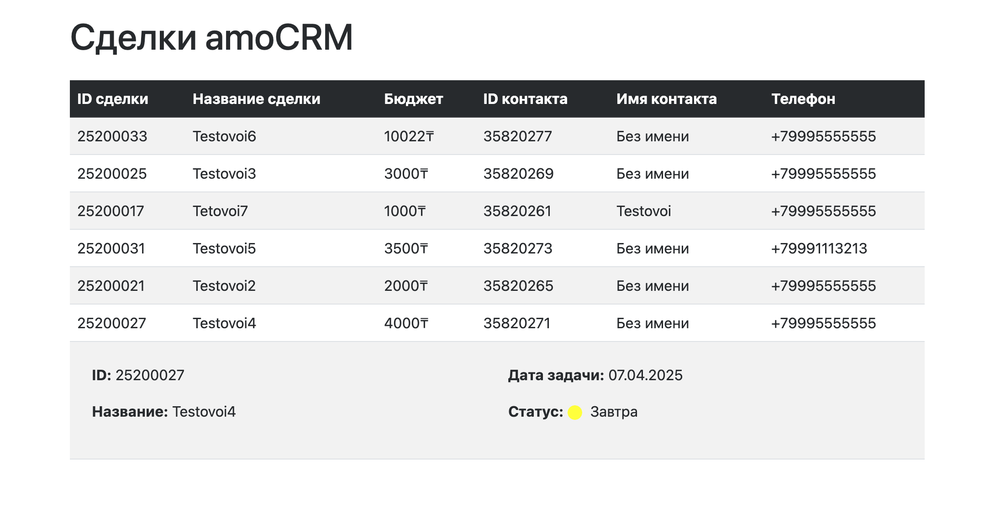

# Тестовое задание для вакансии Frontend-разработчика

## AccessToken

eyJ0eXAiOiJKV1QiLCJhbGciOiJSUzI1NiIsImp0aSI6IjlhOWY2ODlkOGQ0M2QzNDViZDY1OWRjZjdjZWYzMDg1NzgyOTY4OGQ4YmJmM2Q1YmVlNjUzZmQyYjVmMjZiZTQ1ZDNmNDRmMmM0OGVmMmEwIn0.eyJhdWQiOiJmNzVmMWIwYS0zMjU2LTQyYzEtYWUzYi0zMGRiNDA0N2EyMjEiLCJqdGkiOiI5YTlmNjg5ZDhkNDNkMzQ1YmQ2NTlkY2Y3Y2VmMzA4NTc4Mjk2ODhkOGJiZjNkNWJlZTY1M2ZkMmI1ZjI2YmU0NWQzZjQ0ZjJjNDhlZjJhMCIsImlhdCI6MTc0Mzg2OTYwNSwibmJmIjoxNzQzODY5NjA1LCJleHAiOjE3NDM5NTYwMDUsInN1YiI6IjEyMzI0MjgyIiwiZ3JhbnRfdHlwZSI6IiIsImFjY291bnRfaWQiOjMyMzI5OTc4LCJiYXNlX2RvbWFpbiI6ImFtb2NybS5ydSIsInZlcnNpb24iOjIsInNjb3BlcyI6WyJwdXNoX25vdGlmaWNhdGlvbnMiLCJmaWxlcyIsImNybSIsImZpbGVzX2RlbGV0ZSIsIm5vdGlmaWNhdGlvbnMiXSwiaGFzaF91dWlkIjoiMzcyMmFhOWEtMjAwNC00NmU3LTgwZGUtMmZmNDA0YzAyOGQ3IiwiYXBpX2RvbWFpbiI6ImFwaS1iLmFtb2NybS5ydSJ9.o2RdYbl7rlFYH215mPRN0e7aSSEp4Jz32minUiJRfFwwjZK5naNXPKw1CO48aL5yM-TbeCAv2lDIaL_uY3dSTQru495IHmGZo_AymKoNPJuo02Ekd2dIDz9Ct74cQa-zWWIyHaweKIjGarToc-s28lEMwoCK14adjmQtaLemS6kb56XXoi7kZnu6p5PpDhUeYYQy1LFJ7SClDcu1GHSOq-QKKlCFBWQqjN0ynWx4y3ME_MTBLS9rIoqw_LWa8zu0IgsKD5OHheCztLVAFiWhOrE5v6zmkHlockiLpv970ObyzAlGiNNiK4dRDwcJucBcbMj9YI9tcjQa4IbAYk8O4w

## RefreshToken

def5020020a43c0a6b73694a9cf1626ec8f8a859d392664ccdc4b120f18fd6f2f63c48490fb47c8fb1b4ec0fb1a9bdb0a69b66589a66734578ab5f6c08e98bedd539c55606393b85bc17a09270d7deb5501bd799d387085d9c2d1079dbb4cace77b2e5e3ea4a9c85e2becff5032a17f6a128cec10b3dfe42bd0bcc90a40d9fbc92886360ca5edfbafb9d1dbcbee10f87f8f4f4b9420869117d8e5c87bd3653deeea05505311896bee341dae53848a729cad13b5ffbc0b543c330d6c3bf4d1d7d716e6142aec51181525e14e6f76ef5f4783a25a9b830c16489dd59315a3618498fe02dc6a68173fc5e28fce7e1b30f001cf6d2dcaf9b966098d982bc5d3705f06a6e40f6b945ce8c5d0360a4584ab3b3cd2aae5b01475c94f8d53132eef1982dbd9ec0c3a37074515dc54b71fdecaac8de9e3c9f98beb1da3291daed8b1e631cb17ec0e7d23f0e54c692408515b9f539c0401db46801f99b0f49d60fa9e081af806d27e369407cb893a2165ede4ca096c28c40634b921775e20b35666797b00072b12810aecf960ab449091a2da2422cd8158f137c4ca24c790d8077c3256808b9b417026420fa64d79652dedaefb29fe4a40f4524f55872fd36c850f2fc3bc12a17602eb8be9b52ce498ea3cd0bc7ac37b46a692fc3ba50a93209173470462a44d5a4acb1e316e761f3dc349a46

Основные задачи:

1. Сверстать страницу с таблицей сделок.
2. Получить данные из amoCRM по API и отобразить их на странице.
3. Обработать CORS-политику с использованием локального или внешнего прокси-сервера.
4. Реализовать функционал отображения статусов задач с использованием цветных кругов.
5. Добавить возможность развертывания карточек сделок с дополнительной информацией при нажатии.

## Инструкция по запуску

1. **Запуск проекта**:

   - Скачайте проект.
   - Откройте файл `index.html` в браузере.
   - Для работы с API можно использовать есть много способов обхода CORS.
   - Пробовал через публичный URL, но там есть лимиты, еще через браузерные расширения по типу (Allow CORS) не помогло.
   - Самый оптимальный вариант, это запуск Chrome с отключенной проверкой CORS.

## Для macOS

- Закройте все окна Google Chrome.
- Откройте **Terminal**.
- Введите следующую команду для запуска Chrome с отключённой проверкой CORS:
  ```bash
  open -na "Google Chrome" --args --disable-web-security --user-data-dir=/tmp/chrome_dev
  ```

## Для Windows

- Закройте все окна Google Chrome.
- Откройте **Command Prompt**.
- Введите следующую команду для запуска Chrome с отключённой проверкой CORS:
  ```bash
  start chrome --disable-web-security --user-data-dir="C:\chrome_dev"
  ```
- Новый экземпляр Google Chrome откроется без проверки CORS.

2. **Параметры и настройки**:

   - Внесите ваш **access_token** в блоке `<script>` в соответствующем месте, чтобы подключить API.
   - Убедитесь, что вы создали как минимум 6 сделок в amoCRM, как описано в подготовке.

3. **Проверка функциональности**:
   - На странице будут отображены сделки и связанные с ними контакты.
   - При клике на карточку сделки будет выполняться запрос для получения развернутых данных.
   - Статусы задач будут отображаться в виде цветных кругов:
     - **Красный**: задача просрочена (поставлена на вчера).
     - **Зеленый**: задача на сегодня.
     - **Желтый**: задача в будущем.

## Используемые технологии

- **HTML**: Для структуры страницы.
- **CSS**: Для стилизации страницы (с использованием Bootstrap).
- **JavaScript**: Для взаимодействия с API amoCRM и реализации логики на странице.
- **amoCRM API**: Для получения данных о сделках и контактах.

## Примечания

- Важно: API запросы ограничены до 2-х карточек в секунду для соблюдения лимитов amoCRM.
- В коде предусмотрен механизм для обработки CORS-политики.
- Для запуска проекта необходимо иметь доступ к аккаунту amoCRM и valid access_token.

## Ссылка на репозиторий

[Ссылка на репозиторий](https://gitlab.com/yogurtt771/EmfiTask)

## Скриншоты



